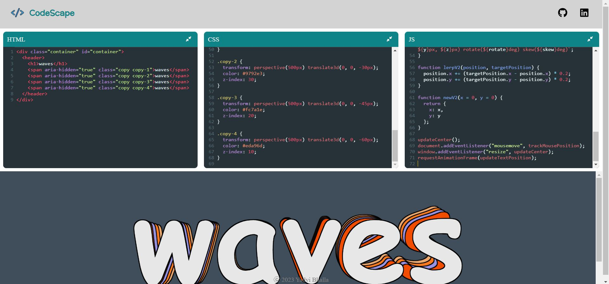

# CodeScape
Online Code Editor for Web Development

### Tech Stacks Used:

### Get Started

### Get Involved

*  Read [Community Guidelines](<https://github.com/yadvi12/Diabetx/blob/main/CONTRIBUTING.md>) for all
   kinds of ways to contribute to and interact with the project,
   including how to submit bug reports and
   code to CodeScape.
*  Submit a proposed code update through a pull request to the ``master`` branch.
*  Talk to us before making larger changes
   to avoid duplicate efforts. This not only helps everyone
   know what is going on, it also helps save time and effort if we decide
   some changes are needed.

